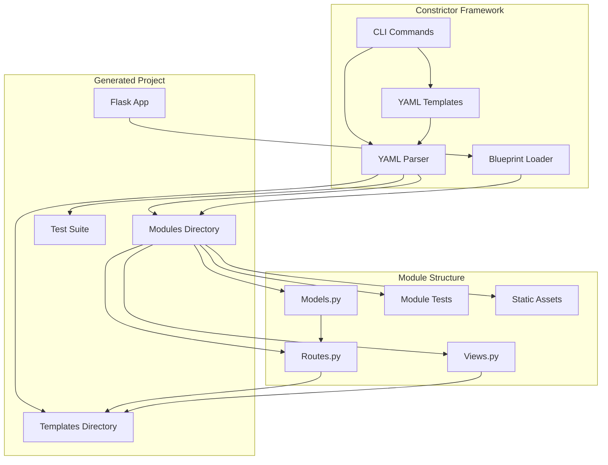

# Constrictor

Constrictor is a microframework based on Flask, designed to simplify the creation and management of modular Flask applications. With features inspired by Rails, Constrictor allows for easy module generation, testing, and execution using YAML-based templates for maximum flexibility.

## Features

- **Modular Structure**: Organize your Flask app into separate modules with ease.
- **Blueprint Support**: Seamless integration with Flask Blueprints.
- **YAML Templates**: Generate modules using declarative YAML templates for maximum flexibility and customization.
- **Command-Line Interface**: Simplified commands for creating projects, generating modules, running the app, and testing.
- **Environment Configuration**: Load configurations from `.env` files and environment variables.
- **Automated Testing**: Built-in test generation and execution for all modules.

## Installation

Install Constrictor via pip:

```bash
pip install constrictor
```

## Architecture

Constrictor follows a modular architecture where each module is self-contained with its own routes, models, views, templates, and tests. The framework uses YAML templates to define the structure and content of generated modules.

### Project Structure

When you create a project with Constrictor, it generates the following structure:

```
project_name/
├── app.py                 # Main Flask application
├── __init__.py           # Package initialization
├── .env.example          # Environment variables template
├── .gitignore           # Git ignore file
├── requirements.txt     # Python dependencies
├── templates/           # HTML templates (centralized)
│   └── module_name/
│       └── index.html
├── modules/             # Application modules
│   └── module_name/
│       ├── __init__.py
│       ├── routes.py    # Blueprint routes
│       ├── models.py    # Data models
│       ├── views.py     # View functions
│       ├── tests/       # Module tests
│       │   └── test_module_name.py
│       ├── views/       # Additional views
│       ├── models/      # Additional models
│       └── static/      # Static assets
└── .venv/              # Virtual environment
```

### Architecture Diagram



## Quick Start

1. **Create a New Project**:
   
   ```bash
   constrictor new project_name
   ```

2. **Generate a New Module**:

   ```bash
   constrictor generate module_name
   # or use the alias
   constrictor g module_name
   ```

   **Generate with Custom Template**:
   
   ```bash
   constrictor generate module_name --template custom_template.yml
   ```

3. **Run the App**:

   ```bash
   constrictor run
   ```

4. **Run Tests for All Modules**:

   ```bash
   constrictor test
   ```

5. **Run Tests for Specific Modules**:

   ```bash
   constrictor test module1 module2
   ```

## YAML Templates

Constrictor uses YAML templates to define the structure and content of generated modules. This approach provides maximum flexibility and allows for easy customization.

### Default Template Structure

The default YAML template includes:

- **Routes**: Define API endpoints and web routes
- **Templates**: HTML templates with Jinja2 support
- **Tests**: Automated test generation
- **Models**: Data models and business logic
- **Views**: View functions and controllers

### Creating Custom Templates

You can create custom YAML templates to suit your specific needs:

```yaml
module:
  name: "{{module_name}}"
  description: "Custom module template"

routes:
  - path: "/{{module_name}}/"
    method: "GET"
    function: "index"
    template: "{{module_name}}/index.html"
    response_type: "html"

templates:
  - name: "index.html"
    path: "{{module_name}}/index.html"
    content: |
      <!DOCTYPE html>
      <html>
      <head>
          <title>{{module_name|title}} Module</title>
      </head>
      <body>
          <h1>{{module_name|title}} Module</h1>
      </body>
      </html>
```

### Template Variables

Templates support Jinja2 syntax with the following variables:

- `{{module_name}}`: The name of the module being generated
- `{{module_name|title}}`: Capitalized module name
- Custom variables can be added to the template context

## Commands Reference

### Project Management

- `constrictor new <project_name>`: Create a new Constrictor project
- `constrictor generate <module_name>`: Generate a new module using YAML templates
- `constrictor generate <module_name> --template <template.yml>`: Generate module with custom template

### Development

- `constrictor run`: Start the development server
- `constrictor run --host <host> --port <port>`: Start server with custom host/port
- `constrictor run --debug`: Start server in debug mode

### Testing

- `constrictor test`: Run all tests
- `constrictor test <module1> <module2>`: Run tests for specific modules

## Dependencies

Constrictor requires the following Python packages:

- **Flask**: Web framework
- **Click**: Command-line interface
- **PyYAML**: YAML template processing
- **pytest**: Testing framework
- **pytest-flask**: Flask testing utilities
- **python-dotenv**: Environment variable management

## Contributing

1. Fork the repository
2. Create a feature branch
3. Make your changes
4. Add tests for new functionality
5. Submit a pull request

## License

This project is licensed under the MIT License.

## Documentation

In construction.