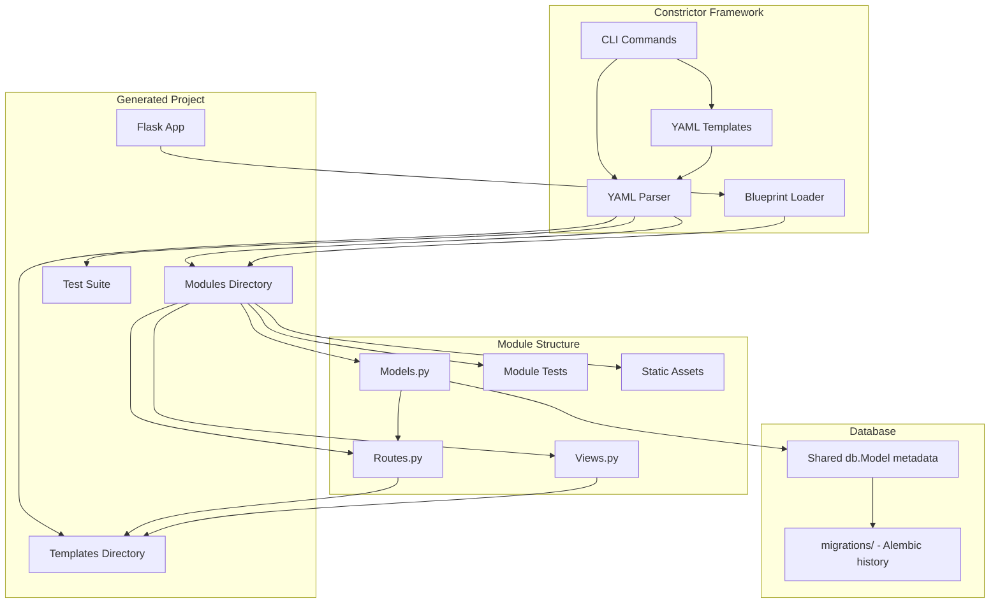

# Constrictor

Constrictor is a microframework based on Flask, designed to simplify the creation and management of modular Flask applications. With features inspired by Rails, Constrictor allows for easy module generation, testing, and execution using YAML-based templates for maximum flexibility.

## Features

- **Modular Structure**: Organize your Flask app into separate modules with ease.
- **Blueprint Support**: Seamless integration with Flask Blueprints.
- **YAML Templates**: Generate modules using declarative YAML templates for maximum flexibility and customization.
- **Command-Line Interface**: Simplified commands for creating projects, generating modules, running the app, and testing.
- **Environment Configuration**: Load configurations from `.env` files and environment variables.
- **Automated Testing**: Built-in test generation and execution for all modules.
- **Per-Module Models with Project-Wide Migrations**: Each module owns its models as SQLAlchemy classes; `constrictor db` autogenerates and applies a single migration history across all of them, with optional per-module pre/post migration hooks.

## Installation

Install Constrictor via pip:

```bash
pip install constrictor
```

## Architecture

Constrictor follows a modular architecture where each module is self-contained with its own routes, models, views, templates, and tests. The framework uses YAML templates to define the structure and content of generated modules.

### Project Structure

When you create a project with Constrictor, it generates the following structure:

```
project_name/
├── app.py                 # Main Flask application (Flask, db, migrate all wired here)
├── .env.example          # Environment variables template
├── .gitignore           # Git ignore file
├── requirements.txt     # Python dependencies
├── migrations/           # Alembic migration history (created by `constrictor db init`)
│   └── versions/
├── templates/           # HTML templates (centralized)
│   └── module_name/
│       └── index.html
├── modules/             # Application modules
│   └── module_name/
│       ├── __init__.py
│       ├── routes.py    # Blueprint routes
│       ├── models.py    # SQLAlchemy models (db.Model subclasses)
│       ├── views.py     # View functions
│       ├── premigrate.py   # Optional: run(app) before `db upgrade`/`db downgrade`
│       ├── postmigrate.py  # Optional: run(app) after `db upgrade`/`db downgrade`
│       ├── tests/       # Module tests
│       │   └── test_module_name.py
│       ├── views/       # Additional views
│       └── static/      # Static assets
└── .venv/              # Virtual environment
```

> Note: the project root deliberately has no `__init__.py`. `modules/` is importable as an implicit namespace package without one, and adding one would make Flask/Alembic treat the whole project as a package, which relocates `instance_path` (and therefore relative SQLite paths) to the *parent* of the project directory.

### Architecture Diagram


```mermaid
graph TB
    subgraph "Constrictor Framework"
        CLI[CLI Commands]
        YAML[YAML Templates]
        Parser[YAML Parser]
        Loader[Blueprint Loader]
    end
    
    subgraph "Generated Project"
        App[Flask App]
        Modules[Modules Directory]
        Templates[Templates Directory]
        Tests[Test Suite]
    end
    
    subgraph "Module Structure"
        Routes[Routes.py]
        Models[Models.py]
        Views[Views.py]
        ModuleTests[Module Tests]
        Static[Static Assets]
    end

    subgraph "Database"
        SharedDB[Shared db.Model metadata]
        Migrations[migrations/ - Alembic history]
    end
    
    CLI --> YAML
    CLI --> Parser
    YAML --> Parser
    Parser --> Modules
    Parser --> Templates
    Parser --> Tests
    
    App --> Loader
    Loader --> Modules
    
    Modules --> Routes
    Modules --> Models
    Modules --> Views
    Modules --> ModuleTests
    Modules --> Static
    
    Routes --> Templates
    Views --> Templates
    Models --> Routes
    Models --> SharedDB
    SharedDB --> Migrations
```

## Quick Start

1. **Create a New Project**:
   
   ```bash
   constrictor new project_name
   ```

2. **Generate a New Module**:

   ```bash
   constrictor generate module_name
   # or use the alias
   constrictor g module_name
   ```

   **Generate with Custom Template**:
   
   ```bash
   constrictor generate module_name --template custom_template.yml
   ```

3. **Run the App**:

   ```bash
   constrictor run
   ```

4. **Run Tests for All Modules**:

   ```bash
   constrictor test
   ```

5. **Run Tests for Specific Modules**:

   ```bash
   constrictor test module1 module2
   ```

## YAML Templates

Constrictor uses YAML templates to define the structure and content of generated modules. This approach provides maximum flexibility and allows for easy customization.

### Default Template Structure

The default YAML template includes:

- **Routes**: Define API endpoints and web routes
- **Templates**: HTML templates with Jinja2 support
- **Tests**: Automated test generation
- **Models**: Data models and business logic
- **Views**: View functions and controllers

### Creating Custom Templates

You can create custom YAML templates to suit your specific needs:

```yaml
module:
  name: "{{module_name}}"
  description: "Custom module template"

routes:
  - path: "/{{module_name}}/"
    method: "GET"
    function: "index"
    template: "{{module_name}}/index.html"
    response_type: "html"

templates:
  - name: "index.html"
    path: "{{module_name}}/index.html"
    content: |
      <!DOCTYPE html>
      <html>
      <head>
          <title>{{module_name|title}} Module</title>
      </head>
      <body>
          <h1>{{module_name|title}} Module</h1>
      </body>
      </html>
```

### Template Variables

Templates support Jinja2 syntax with the following variables:

- `{{module_name}}`: The name of the module being generated
- `{{module_name|title}}`: Capitalized module name
- Custom variables can be added to the template context

## Models and Migrations

Each module owns its models in `modules/<module_name>/models.py`, defined as SQLAlchemy classes that import the shared `db` object from `constrictor`:

```python
from constrictor import db

class ArticleModel(db.Model):
    __tablename__ = "article"

    id = db.Column(db.Integer, primary_key=True)
    name = db.Column(db.String(255), nullable=False)
```

Importing `db` from `constrictor` (instead of creating a new `SQLAlchemy()` instance per module) is what lets every module's tables register onto one shared metadata, so a single migration history can be autogenerated across all of them. `constrictor.load(app)` automatically imports every module's `models.py` alongside its `routes.py`, so nothing needs to be manually registered.

### Migration Commands

```bash
# One-time per project: create the migrations/ directory
constrictor db init

# Autogenerate a revision from the current state of all modules' models
constrictor db migrate -m "add article table"

# Apply pending migrations
constrictor db upgrade

# Revert the last migration
constrictor db downgrade
```

`constrictor db upgrade`/`downgrade` resolve the database connection from `DATABASE_URL` in `.env` (defaults to `sqlite:///app.db`, resolved under the Flask `instance/` folder).

### Pre/Post Migration Hooks

If a module needs to run code before or after a migration (e.g. a data backfill, or validating preconditions), add an optional `premigrate.py` and/or `postmigrate.py` next to its `models.py`, each exposing a `run(app)` function:

```python
# modules/article/postmigrate.py
def run(app):
    with app.app_context():
        from constrictor import db
        from modules.article.models import ArticleModel
        # e.g. seed default rows, backfill a new column, etc.
```

These are entirely optional and auto-discovered — a module without one is simply skipped. `constrictor db upgrade`/`downgrade` run every module's `premigrate.py` (in module-listing order) before the migration, and every module's `postmigrate.py` after it succeeds.

## Swagger Documentation Generation

Constrictor includes built-in support for generating Swagger/OpenAPI documentation automatically from your modules. This feature analyzes your route definitions and generates comprehensive API documentation.

### Features

- **Automatic Discovery**: Scans all modules and extracts route information
- **Enhanced Metadata**: Supports template metadata for detailed API documentation
- **Multiple Formats**: Generate documentation in JSON or YAML format
- **Swagger UI Integration**: Built-in server for viewing documentation
- **Dynamic Updates**: Documentation stays current with your code changes

### Basic Usage

```bash
# Generate basic Swagger documentation
constrictor swagger build

# Generate in YAML format
constrictor swagger build --format yaml

# Specify custom output file
constrictor swagger build --output api-docs.json

# Generate and serve with Swagger UI
constrictor swagger build --serve

# Serve on custom port
constrictor swagger build --serve --port 8080
```

### Enhanced Documentation with Templates

You can enhance your API documentation by adding Swagger metadata to your YAML templates:

```yaml
routes:
  - path: "/users/"
    method: "GET"
    function: "get_users"
    swagger:
      summary: "Get users list"
      description: "Returns a paginated list of users"
      tags: ["users"]
      parameters:
        - name: "limit"
          in: "query"
          description: "Maximum number of users to return"
          required: false
          schema:
            type: integer
            minimum: 1
            maximum: 100
      responses:
        200:
          description: "List of users returned successfully"
          content:
            application/json:
              schema:
                type: object
                properties:
                  users:
                    type: array
                    items:
                      type: object
                      properties:
                        id:
                          type: integer
                        name:
                          type: string
```

### Example Output

The generated documentation includes:
- Complete API specification in OpenAPI 3.0 format
- All routes from all modules
- Parameter definitions and validation rules
- Response schemas and examples
- Module-based organization with tags

## Commands Reference

### Project Management

- `constrictor new <project_name>`: Create a new Constrictor project
- `constrictor generate <module_name>`: Generate a new module using YAML templates
- `constrictor generate <module_name> --template <template.yml>`: Generate module with custom template

### Development

- `constrictor run`: Start the development server
- `constrictor run --host <host> --port <port>`: Start server with custom host/port
- `constrictor run --debug`: Start server in debug mode

### Testing

- `constrictor test`: Run all tests
- `constrictor test <module1> <module2>`: Run tests for specific modules

### Database Migrations

- `constrictor db init`: Create the migrations/ directory (once per project)
- `constrictor db migrate -m "<message>"`: Autogenerate a revision from all modules' models
- `constrictor db upgrade [revision]`: Apply migrations (default: `head`), running pre/post hooks
- `constrictor db downgrade [revision]`: Revert migrations (default: one step back), running pre/post hooks

### Documentation

- `constrictor swagger build`: Generate Swagger/OpenAPI documentation from all modules
- `constrictor swagger build --output <file>`: Specify output file name
- `constrictor swagger build --format <json|yaml>`: Choose output format (default: json)
- `constrictor swagger build --serve`: Serve Swagger UI after generation
- `constrictor swagger build --serve --port <port>`: Serve Swagger UI on custom port

## Dependencies

Constrictor requires the following Python packages:

- **Flask**: Web framework
- **Click**: Command-line interface
- **PyYAML**: YAML template processing
- **pytest**: Testing framework
- **pytest-flask**: Flask testing utilities
- **python-dotenv**: Environment variable management
- **Flask-SQLAlchemy**: ORM for module models
- **Flask-Migrate**: Alembic-backed schema migrations

## Contributing

1. Fork the repository
2. Create a feature branch
3. Make your changes
4. Add tests for new functionality
5. Submit a pull request

## License

This project is licensed under the MIT License.

## Documentation

In construction.